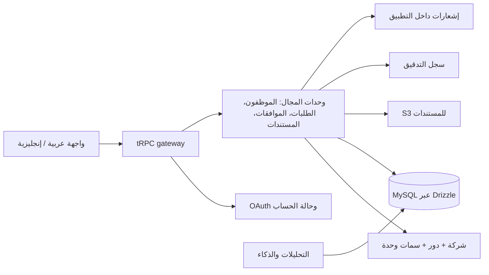

# أساس المنتج المؤسسي لـ HR HBS

## 1. القرار المنتجّي

يُبنى **HR HBS** كمنصة مستقلة لإدارة القوى العاملة والعمليات الحكومية، لا كنسخة من أي منتج قائم. توضح مراجعة تجربة المنتجات المرجعية أن السوق يتوقع تجميع عمليات الموارد البشرية الأساسية، والمواهب، والمصروفات، والامتثال في تجربة متماسكة [1] [2]. يتميز HR HBS بربط هذه التجربة بحوكمة وصول دقيقة على مستوى الشركة والوحدة، وقوالب تشغيل قابلة للتخصيص، وطبقة ذكاء تفسر مؤشرات التشغيل ولا تكتفي بعرضها.

| البعد | المبدأ المؤسسي لـ HR HBS | قرار التنفيذ الأول |
|---|---|---|
| الهوية | عربية أولاً، مع جاهزية LTR والإنجليزية | تصميم مستقل بلون أخضر داكن وذهبي هادئ؛ لا نسخ للنص أو الهوية أو الصور المرجعية |
| المستأجرون | عزل واضح للشركات والبيانات | `companies` و`companyId` للحسابات والقوالب؛ توسعة النطاق تدريجياً إلى بقية الوحدات |
| الوصول | RBAC مع سمات الوحدة والشركة | دور الحساب + صلاحيات عرض/إدارة لوحدتي HR والعلاقات الحكومية + قوالب شركة |
| الحوكمة | كل قرار حساس قابل للتتبع | سجل تفعيل الحسابات وسجل تغيّر صلاحيات الوحدات؛ سجل تدقيق موحّد في المراحل التالية |
| الذكاء | توصيات تفسيرية تحت تحكم الإنسان | ملخص مؤشرات وخطط HR موجودان؛ الاعتماد والتنفيذ البشريان يظلان إلزاميين |

> **حد المنتج:** لا يقدم الإصدار الحالي استشارة قانونية أو تعهداً بالامتثال. تُعرض قوائم الامتثال كإشارات تشغيلية ينبغي مراجعتها مع مختص محلي.

## 2. تحليل المرحلة صفر

تتميز تجربة المنتجات المرجعية بتقسيم واضح إلى حزمة للموارد البشرية، وحزمة للمواهب، وحزمة للمصروفات؛ كما تخاطب أدواراً متعددة من الموظف إلى مدير الموارد البشرية والرواتب [1]. كما تبرز دراسة التحديث السحابي أهمية عزل الأحمال، وقاعدة البيانات المُدارة، وسجلات الأمن، والبنية المرنة للمنصات التي تتعامل مع بيانات موظفين حساسة [3].

يحوّل HR HBS هذه المبادئ إلى تجربة أكثر تركيزاً: يدخل كل مستخدم إلى مساحة عمل تقوده إلى **الإجراء التالي**، بينما يرى المسؤول خريطة وصول قابلة للمراجعة، ويرى المدير موافقات فريقه، ويرى الموظف طلباته دون ازدحام تشغيلي. لا تُنسخ أي شهادات عملاء أو أرقام أو صور أو نصوص تسويقية من المصدر المرجعي.

## 3. الشخصيات وحالات الاستخدام

| الشخصية | الحاجة الأساسية | حالة الاستخدام ذات الأولوية |
|---|---|---|
| مالك الشركة | رؤية تشغيلية ومالية موثوقة | الاطلاع على مؤشرات القوى العاملة والتنبيهات والموافقات عالية الأثر |
| مدير الموارد البشرية | تشغيل رحلة الموظف وضبط السياسات | مراجعة الطلبات، تعيين الصلاحيات، متابعة الاستعداد التشغيلي |
| مدير المالية | التحكم في المصروفات والبيانات المالية | اعتماد طلبات المصروفات وربطها بسياسة الشركة |
| المدير المباشر | اتخاذ قرار سريع لفريقه | استقبال قائمة موافقات وخلاصة سياق الطلب |
| الموظف | خدمة ذاتية واضحة | إرسال طلب ومتابعته ورفع مستنداته |
| مسؤول الشركة | ضبط الوصول والتهيئة | تفعيل الحسابات وتطبيق قوالب الصلاحيات المخصصة |
| مسؤول المنصة | حوكمة المستأجرين وتشغيل المنصة | مراقبة صحة الشركات، السياسات العامة، وسجل التدقيق |

## 4. PRD للإصدار المؤسسي الأول

### الرؤية

تقديم نظام تشغيل أعمال عربي موحّد يجعل عمليات الموظف والمدير والموارد البشرية والعلاقات الحكومية قابلة للتنفيذ والقياس والمراجعة من مساحة واحدة.

### نطاق MVP المؤسسي

| الوحدة | نتيجة المستخدم | معيار قبول مختصر |
|---|---|---|
| الشركات والوصول | حسابات معزولة وصلاحيات قابلة للتخصيص | لا يستطيع مسؤول شركة قراءة أو تطبيق قالب شركة أخرى |
| دليل الموظفين | هوية تشغيلية للموظف وبيانات القسم والمدير | عرض قائمة آمنة حسب الشركة مع حالة فارغة وتحميل وخطأ |
| الموافقات | مسار اعتماد واضح للطلبات | انتقال الطلب بين حالات محددة مع قرار وملاحظة وسجل تدقيق |
| المستندات | روابط مستندات آمنة لا ملفات داخل قاعدة البيانات | تخزين المرجع في S3 وربطه بصاحب المستند وصلاحيته |
| الإشعارات | تنبيه قابل للتتبع للقرار التالي | إنشاء إشعار داخل التطبيق عند وصول مهمة موافقة أو تغيير حالة |
| القيادة والتحليلات | مؤشرات عملية قابلة للتفسير | بطاقات مقاييس مع مقارنة شهرية وملخص مساعد ذكي |

### خارج نطاق MVP

يشمل ما بعد MVP الرواتب الفعلية، الحضور البيومتري، المحاسبة العامة، التسوية البنكية، سوق التكاملات، تعدد العملات الكامل، وتطبيق جوال أصلي. لا تُبنى عمليات الرواتب أو التكاملات التنظيمية قبل اعتماد المتطلبات القانونية والعقود التكاملية لكل سوق.

## 5. قصص مستخدم ومعايير قبول مختارة

| القصة | معيار القبول |
|---|---|
| بصفتي مسؤول شركة، أريد حفظ قالب «منسق فرع» لأطبقه على موظفين جدد | يُحفظ القالب باسم فريد داخل الشركة، ويحتوي الدور وصلاحيات HR/العلاقات الحكومية، ويظهر في قائمة التطبيق |
| بصفتي مديراً، أريد معرفة ما يتطلب موافقتي | تظهر قائمة موافقات خاصة بي فقط، مع نوع الطلب ومالكه وقرار الاعتماد أو الرفض وملاحظة إلزامية عند الرفض |
| بصفتي موظفاً، أريد متابعة طلبي | لا أرى إلا طلباتي وسجل الأحداث المرئي لي، وتتغير الحالة بعد قرار مخوّل فقط |
| بصفتي مسؤول منصة، أريد التدقيق في القرارات الحساسة | تُسجل تغيرات التفعيل، والدور، والوصول، والقالب، والموافقات مع الفاعل والوقت والسياق |

## 6. المعمارية الأولية والقرار التقني

يستمر الإصدار الحالي على React 19 وTypeScript وTailwind 4 وExpress وtRPC وDrizzle/MySQL، بدلاً من إعادة كتابة غير مبررة إلى إطار جديد. يحافظ هذا على التدفقات الحالية ويتيح التوسع المرحلي. تصبح طبقات المنصة كالآتي:

### مبادئ العزل والأمن

تحتوي كل عملية مجال جديدة على `companyId` وتتحقق منه في إجراء الخادم، ولا يكفي إخفاء الواجهة. تظل كلمات المرور خارج التطبيق بسبب الدخول الموحد. تحفظ الملفات في S3 مع بيانات وصفية وصلاحيات في قاعدة البيانات. تبنى سجلات التدقيق كبيانات غير قابلة للتعديل من الواجهات. وتستند خطة النضج التشغيلي إلى مبدأ العزل وقابلية التوسع المشاهد في المنصات السحابية الحديثة [3].

## 7. واجهات API المقترحة

| المجال | العقد | الغرض |
|---|---|---|
| الموظفون | `employees.list/create/update` | دليل الموظفين داخل الشركة فقط |
| الأقسام | `departments.list/create/update` | بنية تنظيمية وربط المديرين |
| الموافقات | `approvals.inbox/decide/history` | صندوق قرار موحد ومسار تدقيق |
| المستندات | `documents.requestUpload/list/revoke` | مراجع S3 مؤمنة وسجل وصول |
| الإشعارات | `notifications.list/markRead` | تنبيهات تنفيذية داخل المنتج |
| سجل التدقيق | `audit.list` | قراءة مقيدة للمسؤولين والمشرفين |

## 8. خارطة 90 يوماً

| الفترة | المخرج القابل للقياس | المسؤول الافتراضي |
|---|---|---|
| الأيام 1–30 | دليل الموظفين والأقسام، العزل الشامل للشركة، ومركز قوالب الوصول | المنتج، المعمارية، الواجهة والخادم |
| الأيام 31–60 | محرك موافقات أساسي، صندوق المدير، الإشعارات، وسجل تدقيق موحد | الخلفية، الجودة، الأمن |
| الأيام 61–90 | مركز مستندات S3، تحليلات قيادة محسنة، تجربة إنجليزية، وفحوص أداء ووصول | المنصة، البيانات، التصميم والجودة |

## 9. مؤشرات النجاح

تقاس الجاهزية بنسبة تفعيل الحسابات ضمن المهلة، ووقت اتخاذ قرار الموافقة، ونسبة الطلبات التي تكتمل من دون تدخل يدوي، ونسبة قرارات الوصول التي تحتوي سجلاً تدقيقياً، وزمن تحميل المساحات الرئيسية. لا تستخدم المنصة أرقاماً تسويقية مرجعية كمؤشرات نجاح لها؛ تجمع المقاييس من أحداث HR HBS نفسها بعد الإطلاق.

## 10. المراجع

[1]: https://www.jisr.net/ar "جسر: عرض المنتجات والأدوار والحزم"
[2]: https://www.jisr.net/ar/pricing "جسر: وصف الحزم ونطاقاتها"
[3]: https://aws.amazon.com/solutions/case-studies/jisr-case-study/ "AWS: دراسة تحديث منصة SaaS للموارد البشرية"
